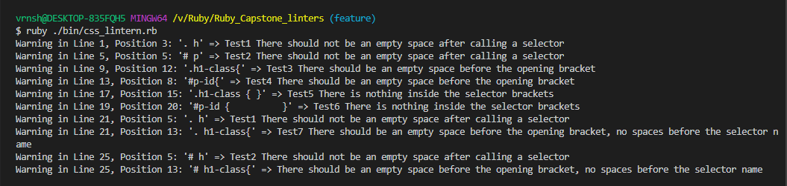

# Ruby_Capstone_linters

# CSS Lintern - Ruby Capstone Project
> In this project, i managed to build a helper for the CSS files that are needed to give style to your website. It will read every line of the CSS code to find basic typo warnings that we might do as beginners in the area.

# The Build

The custom Ruby linter currently checks/detects for the following errors/warnings.

    check for spaces after the #  selector
    check for spaces after the . selector
    check for no spaces before opening bracket when using . selector
    check for anything but white spaces inside the brackets when using a . selector
    check for anything but white spaces inside the brackets when using a # selector
    checks for spaces before the selector name and no space after the selector name.
    checks for spaces before the selector name and no space after the # selector name.

Below are demonstrations of good and bad code for the above cases.

## Good Code
~~~ruby

.h1-class {
    color: red;
}

#p-id {
    color: blue;
}

~~~

## Bad Code
~~~ruby

. h1-class {
    color: red;
  } 
  
  # p-id {
    color: blue;
  }
  
  .h1-class{
    color: green;
  }        
  
  #p-id{
    color: greenyellow;
  }
  
  .h1-class { }  
  
  #p-id {          }  
  
  . h1-class{
    color: orangered;
  } 
  
  # h1-class{
    color: orange;
  }
~~~    

## Built With
- Ruby
- RSpec for Ruby Testing

## Testing

To test the code, run rspec from root of the folder using terminal. 

    Rspec is used for the test, to install the gem file,

    But before that, make sure you have bundler installed on your system, else run

$ gem install bundler

$ gem install rspec 

$ run rspec

## Author

👤 Varun Sharma

GitHub: [@Varun2323](https://github.com/Varun2323)

LinkedIn: [Varun Sharma](https://www.linkedin.com/in/varun-sharma-82b29b82/) 

## 🤝 Contributing

Contributions, issues, and feature requests are welcome!

Feel free to check the [issues page](https://github.com/NataJenkins/TicTacToe/issues).

## Show your support

Give a ⭐️ if you like this project!

## Acknowledgments

- The Odin Project[https://www.theodinproject.com/courses/ruby-programming/]

## 📝 License

This project is [MIT](lic.url) licensed.
## Acknowledgments

Project inspired by Microverse